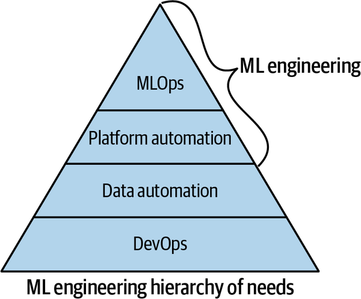
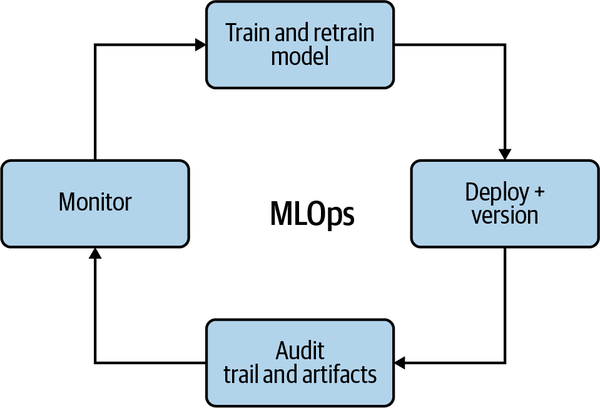

## Introduction to MLOps

MLOps - Machine Learning Operations

**Notes**

Data Science vs Machine Learning Engineer can be viewed as science (research) vs engineering (production).

How to measure success of MLE intiative at organization? First, count ML models in production. Second, measure the impact these ML models have on bussiness ROI. 

MLOps can be thought of as process of automating machine learning using DevOps methodologies. They state that the fundamental problem in getting machine learning models into production is the immaturity of the data science industry.

DevOps benefits boils down to CI, CD, Microservies and Infrastructure as Code (IaC), Monitoring and Instrumentation.

The foundation starts with DevOps followed by data automation, platform automation and finally true ML automation or MLOps occurs.

1. DevOps

   The foundation of DevOps is continous integration. Exercies folder contains some examples for implementing CI (locally using Makefile and remote using Github Actions).

   > Continuous integration (CI) helps developers merge their code changes  back to a shared branch, or “trunk,” more frequently—sometimes even  daily. Once a developer’s changes to an application are merged, those  changes are validated by automatically building the application and  running different levels of automated testing, typically unit and  integration tests, to ensure the changes haven’t broken the app. This  means testing everything from classes and function to the different  modules that comprise the entire app. If automated testing discovers a  conflict between new and existing code, CI makes it easier to fix those  bugs quickly and often.

Continuous deployment i.e., automatically pushing the machine learning project into production would be the next step.

> In practice, continuous deployment means that a developer’s change to a  cloud application could go live within minutes of writing it (assuming  it passes automated testing). This makes it much easier to continuously  receive and incorporate user feedback. Taken together, all of these  connected CI/CD practices make deployment of an application less risky,  whereby it’s easier to release changes to apps in small pieces, rather  than all at once. There’s also a lot of upfront investment, though,  since automated tests will need to be written to accommodate a variety  of testing and release stages in the CI/CD pipeline.

2.  Data Automation

   It is the next step in ML hierarchy of needs. It deals with automating flow of data. This steps creates a clean data ready for ingestion. There are various commerical tools that come under this umbrella that deal with data management, schedule/monitor data processing jobs, data generation/warehousing, versioning, storage, visualization etc.  Many organizations use a centralized data lake as the hub of all activity around data engineering. The reason a data lake is helpful to build automation around, including machine learning.

   For a more comprehensive collection : [Data Pipeline](https://docs.google.com/spreadsheets/d/1i8BzE4puGQ3dmQueu4LQCcwaqrulgK1Vb-xeFwhy6gY/edit#gid=0&range=A29:A119)

3. Platform Automation

   Next step is how to automate building machine learning solutions. There are many commerical tools avaliable to automate this task. Each cloud provider has it's own platform for e.g. GCP has Google AI Platform, Azure has Azure Machine Learning Studio, AWS has AWS Sagemaker, etc.

   For a more comprehensive list: [Platform automation](https://docs.google.com/spreadsheets/d/1i8BzE4puGQ3dmQueu4LQCcwaqrulgK1Vb-xeFwhy6gY/edit#gid=0&range=A158:A285) 

4. MLOps

   After all above layers are automated, MLOps is possible. One way to articulate these best practices is to consider that they create reproducible models with robust model packaging, validation, and deployment. MLOps feedback shown below enhances the ability to explain and observe the model performance.

   

