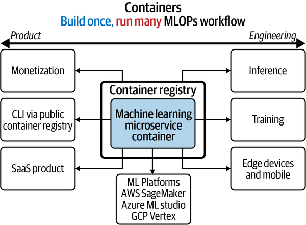

## MLOps for Containers and Edge Devices

**Notes**

This chapter introduces two types of technologies for model deployment : containers and edge devices.

**Virtual Machines**

Virtualization increases efficiency in data centers to let servers run multiple OS and applications. Virtualization provides a virtualized hardware environment where a guest OS is able to run one or more applications. 

> VMs are typically measured by the gigabyte. They usually contain their  own OS, allowing them to perform multiple resource-intensive functions  at once. The increased resources available to VMs allow them to  abstract, split, duplicate, and emulate entire servers, OSs, desktops,  databases, and [networks](https://www.redhat.com/en/topics/virtualization/what-is-nfv). 

**Containers** 

Containers get deployed with all the application code along with its runtime dependencies revolutionizing DevOps. Container host merely provides a logically isolated runtime environment  for the application within the same OS instance. Both virtual machines and containers provide a isolated environment from rest of the system. Containers, unlike  virtual machines, do not require the overhead of booting, managing and  maintaining a guest OS environment. By sharing a container, the friction of setting up the environment is  greatly reduced while ensuring a repeatable system to interact with. 

> Containers are typically measured by the megabyte. They don’t package  anything bigger than an app and all the files necessary to run, and are  often used to package single functions that perform specific tasks  (known as a [microservice](https://www.redhat.com/en/topics/microservices)). The lightweight nature of containers—and their shared operating system  (OS)—makes them very easy to move across multiple environments.

Let's break down and understand one Dockerfile.

```dockerfile
FROM python:3.8-slim
# cache requirements.txt
WORKDIR /app
COPY requirements.txt /app/requirements.txt
RUN pip3 install -r requirements.txt
# copy everything else
COPY . /app
CMD bash
```

In first step,`FROM python:3.8-slim`, we create a first layer by pulling a python 3.8 Docker image from docker hub, a cloud-based registry for Docker images. More python docker images can be found here: https://hub.docker.com/_/python.

> The `FROM` instruction initializes a new build stage and sets the [*Base Image*](https://docs.docker.com/glossary/#base-image) for subsequent instructions. As such, a valid `Dockerfile` must start with a `FROM` instruction. 

In second step, we set the working directory. 

> The `WORKDIR` instruction sets the working directory for any `RUN`, `CMD`, `ENTRYPOINT`, `COPY` and `ADD` instructions that follow it in the `Dockerfile`.

In third step, we copy requirements from current working directory to filesystem in container at specified path. 

> The `COPY` instruction copies new files or directories from `<src>` and adds them to the filesystem of the container at the path `<dest>`.

In fourth step, we install the dependencies required by the application.  Separating `requirements.txt` from rest of the application is best practise since, we can essentially reduce the build time for creating Docker by caching the requirements and even if the code for rest of application changes this layer will not be rebuilt (which takes time to install different dependencies), unless `requirements.txt` file is also changed.

> The `RUN` instruction will execute any commands in a new layer on top of the current image and commit the results. The resulting committed image will be used for the next step in the `Dockerfile`.

In fifth step, we copy rest of our application code to the destination path in container.

In sixth step, we run start a `bash` interpreter when we execute docker with interactive command (-i). There can only be one `CMD` instruction in a `Dockerfile`. If you list more than one `CMD` then only the last `CMD` will take effect.

> The `CMD` instruction should be used to run the software contained in your image, along with any arguments.

Follow this guide for best practices for writing Dockerfiles: https://docs.docker.com/develop/develop-images/dockerfile_best-practices/https://docs.docker.com/develop/develop-images/dockerfile_best-practices/

```bash
docker build -t myimage:latest .
```

To build a container from above Dockerfile, use command above. The `.` in the command provides a build context i.e. the current working directory is called the *build context*. By default, the Dockerfile is assumed to be located here with filename `Dockerfile`. The naming and tagging of images helps when pushing the image to a registry. 

```bash
docker run -it --rm --gpus all -v $(pwd):/app --name my-name-exp myimage:latest bash
```

To run the built container, we run the command above. There are lot many [arguments](https://docs.docker.com/engine/reference/commandline/run/) that can be passed to `docker run` required for different scenarios.

Containerizing deployments help automate, test, debug and run different ML application regardless of the platform and deploy them quickly on any cloud platform or edge devices.




**Edge Devices**

Edge computing helps optimize latency and bandwidth required in traditional client-server long distance communication by bringing computing closer to source of data. If long distances are a problem, imagine what happens when there is no  (or very limited) connectivity like a remote farm. If you need fast  inferencing done in a remote location, the options are limited, and this is where the *deploying to the edge* has an advantage over any data  center.

> According to Gartners prediction, edge AI is still in the innovation trigger phase, and it will reach a plateau of productivity in the  following five to ten years. In the industry, many pilot projects have  also been carried out toward edge AI. Specifically, on the edge AI  service platform, the traditional cloud providers, such as Google, Amazon, and Microsoft, have launched service platforms to bring the  intelligence to the edge, through enabling end devices to run ML  inferences with pretrained models locally. On edge AI chips, various high-end chips designated for running ML models have been made  commercially available on the market, as exemplified by Google Edge TPU, Intel Nervana NNP, and Huawei Ascend 910 and Ascend 310 [^1].

As the need for deploying ML model on edge devices rises, there have been many innovations to optimize the model for both latency and throughput i.e. making predictions in real-time. Some of these include algorithms like quantization, model pruning, knowledge distillation, etc, or libraries such as TensorRT, TF Lite, TF Lite for Microcontrollers, TinyML, etc or hardware such as Nvidia Jetson devices, Google Coral, Arduino, Raspberry Pi, Beagleboards, Intel Neural Compute Stick, etc. Each cloud servie provide has some solution for managing ML application i.e. training, deploying, etc. for edge devices, AI at Edge solution.

For a survey on Machine Learning at the Network Edge: https://arxiv.org/pdf/1908.00080.pdf

[^1]: https://ieeexplore.ieee.org/document/8736011
