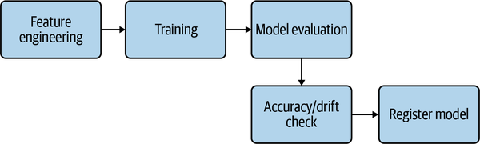

## Continuous Delivery for Machine Learning Models

**Notes**

In this chapter we look at different strategies or pipeline that can be incorporated to create a robust process to ship models into production.

The best way to package a ML model is to containerize it. In previous chapters, we looked at how CI/CD are foundation for robust and automating results. 

Pipeline is series of instructions that are followed step by step to achieve the objective such as registering and publishing a model into a production environment when run.

​															Source: https://www.redhat.com/en/topics/devops/what-cicd-pipeline

Some of basic elements (not strictly included) for CI/CD pipeline are :

1. **Build** - The stage where the application is compiled.

2. **Test** - The stage where code is tested. Automation here can save both time and effort.

3. **Release** - The stage where the application is delivered to the repository.

4. **Deploy** - In this stage code is deployed to production.

5. **Validation and compliance** - The steps to validate a build are determined by the needs of your organization. Image security scanning tools, like [Clair](https://www.redhat.com/en/topics/containers/what-is-clair), can ensure the quality of images by comparing them to known [vulnerabilities (CVEs)](https://www.redhat.com/en/topics/security/what-is-cve).

> Continuous integration (CI) allows our team to develop, test and  integrate code in a structured fashion. This allows the team to more  confidently and frequently develop since their work will be properly  integrated. Continuous delivery (CD) is responsible for delivering our  integrated code to a variety of applications that are dependent on it.  With CI/CD pipelines, we can develop and deploy knowing that our systems can quickly adapt and work as intended. Source: https://madewithml.com/courses/mlops/cicd/

**ML Pipelines**

The same approach of creating pipelines to achieve robust results can be applied to ML models. Here's an  example pipeline consisting of various machine learning operations. Pipeline is not tied to particular model but can be reused for any other models. 

> Reusability of components and automation is another critical component of DevOps that works well when applied to MLOps.

**Controlled Rollout of Models**

There are different strategies that can be employed when deploying the model into production. They can be used depending on use case and pros/cons of the strategy

1. Shadow Deployment
2. Canary Deployment
3. Blue/Green Deployment

Further Reading: https://www.linkedin.com/pulse/ml-models-deployment-strategies-kholoud-ibrahim-

**Testing techniques for Model Deployment**

The approaches below help catch the error earlier in the development before shipping code to production deployment.

> The earlier you can shift left the error detection, the better. This is  because it is cheaper and faster than waiting all the way until it is in production when a rollback needs to happen.

Automated Checking, Linting, Unit Tests : https://realpython.com/python-testing/

Exercise: Implement all learnings into a application (under `exercies` folder)

