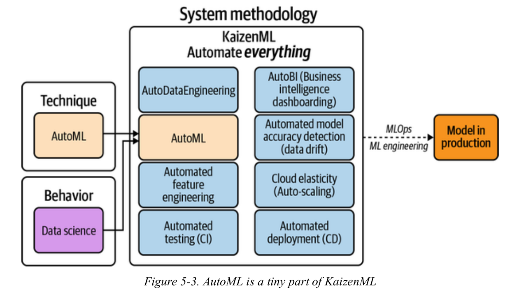

## AutoML and KaizenML

**Notes**

In this chapter we look at why AutoML is essential and how to continously improve the whole system including data, modelling, deploying and monitoring.

**AutoML**

Traditional machine learning pipeline consists of data preparation i.e cleaning data, feature engineering, model selection, hyperparameter tuning for each of the models and visualizing results and perform error analysis. Automated Machine Learning (ML) automates all the steps except the first where only the requirement is to feed a clean dataset. AutoML produces high-performing machine learning models with very little intervention.  

Using AutoML does not require to have any experitise in field of ML. All the major cloud providers such as GCP, Azure, AWS, H2O.ai, Databricks, etc  have their own variant of AutoML flavor. AutoML helps to quickly create a good baseline model with least effort. All major machine learning frameworks have their own variant of automatic machine learning such as [Auto-sklearn](https://automl.github.io/auto-sklearn/master/), [Auto-PyTorch](https://github.com/automl/Auto-PyTorch), [AutoKeras](https://autokeras.com/), etc.

> **While** **AutoML is focused strictly on creating a model from clean data**, **KaizenML is about automating everything about the machine learning**
> **process and improving it.**

There's a variant of AutoML that is used in searching architecture in deep learning called Neural Architecture Search (NAS). Using this approach, there's no need to worry about what size of filter should be applied next in large layers of convolution networks. Networks designed using NAS are on par or outperform hand-designed architectures.

**KaizenML**

Kaizen, i.e., continuous improvement of the entire system from the data to the software, to the model, to the feedback loop from the customer is about improving all aspects of a machine learning system: data quality, software quality, and model quality. KazienML, a term coined by autthors means automate everything so that whole system continuously keeps improving. KaizenML/MLOps is a systems methodology that leads to models in production. AutoML is just one part of entire system that is being automated. There are other parts of systems that can also be automated as shown in the figure below. With KaizenML, every aspect of machine learning, from feature engineering to AutoML, is improved.

Recommeded Reading

- Hidden Technical Debt in Machine Learning Systems : https://papers.nips.cc/paper/2015/file/86df7dcfd896fcaf2674f757a2463eba-Paper.pdf

